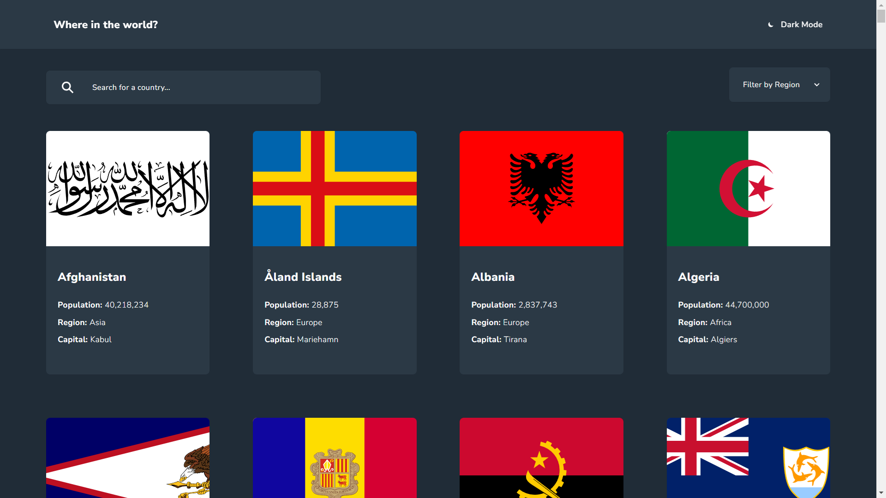

# Frontend Mentor - REST Countries API with color theme switcher solution

This is a solution to the [REST Countries API with color theme switcher challenge on Frontend Mentor](https://www.frontendmentor.io/challenges/rest-countries-api-with-color-theme-switcher-5cacc469fec04111f7b848ca). Frontend Mentor challenges help you improve your coding skills by building realistic projects.

## Table of contents

- [Overview](#overview)
  - [The challenge](#the-challenge)
  - [Screenshot](#screenshot)
  - [Links](#links)
- [My process](#my-process)
  - [Built with](#built-with)
  - [What I learned](#what-i-learned)
  - [Continued development](#continued-development)
  - [Useful resources](#useful-resources)
- [Author](#author)

## Overview

### The challenge

Users should be able to:

- See all countries from the API on the homepage
- Search for a country using an `input` field
- Filter countries by region
- Click on a country to see more detailed information on a separate page
- Click through to the border countries on the detail page
- Toggle the color scheme between light and dark mode _(optional)_

### Screenshot



### Links

- Solution URL: [https://www.frontendmentor.io/solutions/rest-countries-api-with-color-theme-switcher-master-with-css-grid-YS1RyslvFt]
- Live Site URL: [https://mkhululi97.github.io/rest-countries-api-with-color-theme-switcher/]

## My process

### Built with

- Kanban For Planning
- Semantic HTML5 markup
- CSS custom properties
- Flexbox
- CSS Grid
- Mobile-first workflow
- [AlpineJS](https://alpinejs.dev/) - JavaScript framework

### What I learned

- I learned how to read a JSON file with JavaScript, using the import statement.
- That alpine template tags can only contain one root element.
- That x-for only works inside a template tag.
- That you can nest template tags.
- I learned that breaking big functions into many smaller functions, helps me to understand my code better, if anything breaks I know which function is the bug coming from.
- I learned how to get data from a JSON file that has deeper levels of nested objects.

```html
Add type=module to use 'import' statement on your js
<script type="module" src="script.js" defer></script>
```

```js
import countriesData from "./data.json" assert { type: "json" };
```

### Continued development

Get better with CSS, to closely match the app UIs mockup.

### Useful resources

- [https://www.youtube.com/watch?v=Z92PqSyUBSI ] - This helped me to load a local JSON File without Fetch

- [https://stackoverflow.com/questions/65120873/how-to-add-padding-to-the-default-arrow-in-a-select-dropdown-list] - Helped to add padding around the arrow, of the dropdown input.

## Author

My Portfolio - [https://mkhululi97.github.io/portfolio_website/]

My Frontend Mentor Portfolio - [https://www.frontendmentor.io/profile/Mkhululi97]
